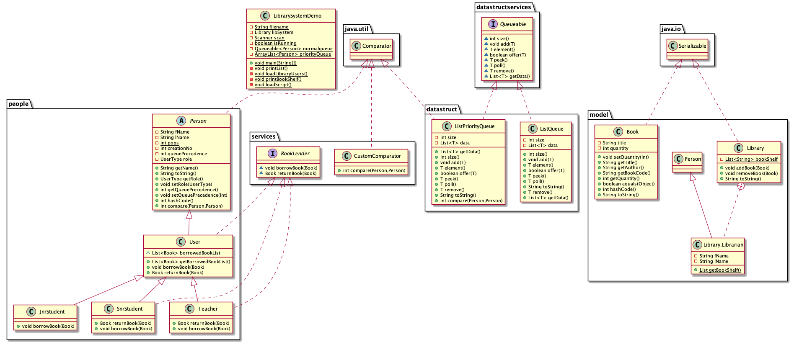

# BOOK LIBRARY

## Problem Description

---

**A book library where a student, teacher borrow books. When the copy of the book is no longer in the library. The library should return ‘book taken’. They can be multiple copies of the same book in the library.**

### Implementation 1

**The books are given by the Librarian on a first come first serve basis, however, when a teacher is requesting for the same book a student is asking for, the teacher comes first, When a junior student is asking for the same book a senior student is asking for, the senior student comes first.**

### Implementation 2

**The books are given by the Librarian on a first come first serve basis, whether you are a teacher, a junior or a senior student.**

---

## Class UML DIAGRAM

---

**Author: Ifeanyichukwu Otiwa**
[Linkdin Profile](https://www.linkedin.com/in/ifeanyichukwu-otiwa-winson/)
